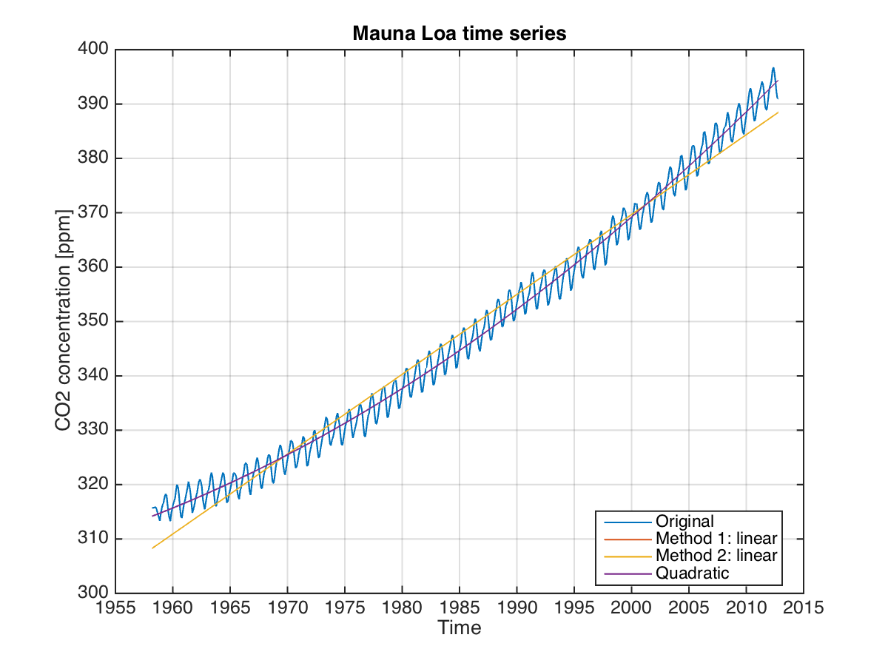

# Trends

One goal of data analysis is to quantify the characteristic pattern or variability of a dataset.  In the case of the time series in Fig. 1, we see an increase in $\mathrm{CO}_2$ concentration with time, as well as some wiggly bits.  In order to objectively quantify the changes we see by eye, using repeatable methods, we can choose to represent the change by a line that best fits the data.  This is called "linear regression", where in this case, the slope of the line represents the rate of increase in the data.  Sometimes we also talk about the "increasing rate of change" or the "acceleration", as in the case of sea level rise.  Not only is sea level rising, the rate at which it is rising is increasing. In order to quantify this change in the rate, we can fit a quadratic (i.e. second order polynomial) to the data, where the slope on squared term gives the acceleration. 


  

**Aim:**  The purpose of this lab is to get you started with elementary time series analysis: fitting a trend and a polynomial to a time series, and calculating the residual error.

**Learning outcomes:**
At the end of this lab, you will be able to:

1. Calculate a linear trend given a time series, and determine its slope and y-offset.
2. Calculate a polynomial fit to the time series, and determine the acceleration.
3. Gain basic familiarity with Matlab class `structure`, `fieldnames+, and familiarity with  _indices_.
4. Use the Matlab functions including:  `polyfit`, `polyval`, `disp`, `grid`, `find`, and the operators `==`, `~` and `.^2`.


**Data:** You will work with the time series of carbon dioxide concentration from the Mauna Loa site, in filename `maunaloa_clean.mat`.

---

# Working with m-files. 

So far in Matlab, we've been typing commands at the command prompt in the command window.  This gives us the benefit of pressing enter and having Matlab evaluate the command and tell us what it thinks immediately.  But what if you want to save your work?  From now on, you should plan to work within an m-file for each new lab.


## Creating an m-file.

- *Option 1:*
For this week, you downloaded an m-file to start with. Next time, you will need to create an m-file.   You can do this in the file menu by selecting `File>New>Script`.  It will create for you an untitled m-file.  Choose `File>Save As...` to give it a name.  Make sure you save it into the same folder for this module.  

- *Option 2:*
Alternatively, you can create a new m-file by typing `edit` into the command window, followed by the name you'd like to give it with the extension `*.m`.  The extension is important to tell Matlab it is a file that contains commands.
```matlab
        >> edit soes2025_trends.m
```
If the file does not already exist, Matlab will ask you if you want to create it.  Click `yes`. 

In both cases, an editor window will open.  You can either pop this in (dock it) in the larger interface window using the little arrow pointing down and to the right or use it separately.  On a Mac, this is in the top left corner.  On Windows, the top right.

<!--
\label{fig:popin}-->

If you were unable to download a text file from the Blackboard website, then select and copy the contents from the website, and paste it into the m-file you have just created.  Now, instead of entering commands at the command prompt, you can edit or execute the m-file.

## Executing the m-file.

Matlab  executes lines of code in sequential order, from top to bottom.  It skips lines that are commented (beginning with the `%` sign).  These comments show up in a different colour than commands in the Matlab editor.  
```matlab
>> disp('Hello World')  % This is a comment
```

To execute commands from or in an m-file, you have a few options.  

- **Starting option:** You can type the commands into your m-file.  When you want to execute them, copy them and paste them into the command window.

- **Advanced option:** You can execute  cells within your m-file.  A _cell_ is a segment of code that is separated by a line that begins with exactly two percent symbols (no spaces between them).  Two percent symbols (`%%`) with no spaces between or before them start a new cell.  Any text that occurs after the two percents is also a comment.

To execute a cell, put the cursor in the cell (use the mouse to click somewhere in it).  The current cell will be highlighted in pale yellow.  Then you can use the keystroke `ctrl-return` to execute  the commands that are highlighted.

---

**Throughout this lab, enter your commands into your m-file rather than the command prompt, then execute the m-file in order to see your results.**  Don't forget to suppress output if you don't want a lot of stuff dumping to the screen each time you run your m-file.

# Exploring the Mauna Loa data

**Load the data** and check what has been loaded (Recall: commands `load` and `whos`).

Plotting your data can be a great way to get an idea of what you've got. **Create figure 1** and plot the $\mathrm{CO}_2$ time series against the time vector using the `figure` and plot` commands.  

```matlab
>> plot(time,co2)
```

Fix the x-axes using the `datetick` command.  (Recall: command `datetick`.)  Add a grid using `grid on`.  


## Calculate some basic statistics 

1. What is the mean of the data?     Specify your answer to the nearest 10th. (Recall: command `mean`.)
<!--348.6 ppm-->

2. What is the max and min?  These are the commands `max` and `min`.  (Use `>> help max` to see how to use it.)  \label{max}
<!--396.8 ppm, 313.2 ppm-->

3. How many years long is the record (i.e. the temporal coverage)?\label{time}  _(Note: Time in Matlab is represented as days since the year 0.  What do you get if you subtract the minimum value in the time vector from the maximum?)_
<!--54.6 years-->

4. How quickly (in ppm/yr) is the concentration of $\mathrm{CO}_2$ increasing?  Approximate, using your answers in (\ref{max})--(\ref{time}).\label{slope}
<!--1.53 ppm/yr-->


## Fit a linear regression to the data

One of the striking characteristics of this time series, which you can see in your figure, it its tendency towards higher $\mathrm{CO}_2$ concentrations.  This might even be called a *trend*.  Let's use Matlab to quantify the trend.

### Method 1: Use the function `detrend` 

Matlab has several ways to fit a trend.  The first is the function `detrend`.  If you read the `>> help detrend`, you will see that this doesn't just fit a linear trend, but in fact removes it.  Detrend the $\mathrm{CO}_2$ time series, and save the result in `co2resid`.
```matlab
>> co2resid = detrend(co2);
```

**Create Figure 2** and plot the detrended data in it to see what Matlab has done.

If you want to isolate just the trend (which was removed by `detrend`), you can calculate the trend as the difference between the original data (`co2`) and the residual (`co2resid`).  Calculate the trend and store  it in a new variable called `co2trend`.
<!--`co2trend = co2-co2resid;`-->

**Update the figure:** Plot this trend line to Figure 1 in a different colour. To be sure you are plotting in Figure 1 and not Figure 2, use the command ` figure(1)` to ``activate'' figure 1 before using adding any additional plotting commands.


### Method 2: Use the function `polyfit`. \label{poly1}

While `detrend` is sufficient in many cases, `polyfit` is a more powerful function, as it provides you with the slope and y-intercept of the regression, and can also be used for higher order fits (like a quadratic regression instead of just a straight line).

Do a `>> help polyfit` to see what this function can do.  Note that it takes 3 inputs: 

- the independent variable (`time`, in our case), 
- the dependent variable (`co2`), and 
- the \textit{order} of the polynomial.  

The order refers to the biggest exponential in the polynomial.  Recall that a 1st order or linear polynomial has the form
$$A x + B\label{eq1}\ ,$$
while a second order or quadratic polynomial has the form
$$A x^2+Bx+C\ .$$

In the example you're doing here, this line represents carbon dioxide concentration, while $x$ represents the time vector.  The term $Ax$ has units of ppm, while $x$ has some sort of time units.

5. What are the \textit{units} of the Matlab vector `time`?
<!--days-->

Fit a linear (1st degree) polynomial to the data using the function `polyfit`.  Use your time vector as the X input, and your data vector as the Y input.

6. What is the slope of the line (i.e. the value of $A$ in equation (\ref{eq1}))?  
<!--$A = 0.004$ ppm/day-->
Convert your answer into units of ppm/yr.  
<!--$A = 1.47$ ppm/yr-->

Use the best fit line to calculate the predicted values with  `polyval`.
```matlab
>> Y = polyval(P,time);
```

**Update Figure 1:** Add this trend line to Figure 1, in a third colour.  You may find that it covers up the previous trend line.

7.  What is the equation of the line that describes this linear regression?  Write a mathematical expression (rather than a Matlab expression) that uses time in years.
<!--$co2 = 1.47 t - 2573.5$-->

8. Using the above equation for carbon dioxide concentration in terms of time, what $\mathrm{CO}_2$ concentration would you predict in 1960?
<!-- 311 ppm-->\label{ans1}

9. Predict the $\mathrm{CO}_2$ concentration in 2100.
<!--517 ppm-->

### Calculating a residual.

Often, we'd like to quantify how good a *best fit* line is.  The measure of the goodness of fit can be estimated using root-mean-squared error of the residual, sometimes referred to as rms.  For a 3-element residual vector, $x'=[x_1, x_2, x_3]$, the rms is then
\begin{equation}
rms(x')=\sqrt{\frac{x_1^2+x_2^2+x_3^2}{3}}
\end{equation}
A smaller rms value indicates a better fit.

Here, we will calculate the rms error between the original Mauna Loa data and the best fit line.  This means that we will first calculate the residual as the difference between the original and the best fit, and the we will square each of the difference values, sum them up, divide the sum by the number of values (which is the same as the length of the vector/time series) and then square root the whole thing.

- **Calculate the residual.**  This is the difference between the original data and the best fit line.
```matlab
>> co2resid = co2 - Y;
```

- **Square the residual.**  In Matlab, recall that if you have a vector or matrix and you want to square the individual elements, you use the *dot* operator, putting a period in front of the notation for squaring as `x.^2`.
<!--```matlab
>> co2resid.^2
```-->

- **Calculate the mean of the squared values.**
<!--
```matlab
>> nanmean(co2resid.^2)
```-->

- **Take the squareroot of the mean.**

10. What value did you get for the rms of the residual?
<!--```matlab
rmsresid = sqrt(nanmean(co2resid.^2));
```-->
<!--3.4 ppm-->


## Using the Matlab function find. 

What was the average value in 1960?  Here we will use the function `year` which takes as an input a value in Matlab time format, and returns the numeric value of the year.  We are also introducing the `find` function, which we'll see quite a bit in future labs.  

First, we translate Matlab time into years:
```matlab
>> yearvec = year(time);
```
Then we apply a Boolean or true/false test to find whether particular elements in our vector, `yearvec` are equal to 1960 (`==`).  The result is a vector which we are calling `test_is_1960` which is filled with 0s or 1s.  0s when the values did not satisfy the Boolean, i.e. weren't from 1960, and 1s otherwise.
```matlab
>> test_is_1960 = yearvec==1960;
```
The third line takes the 1s and 0s from the Boolean `test_is_1960` and returns their positions within the vector.  
```matlab
>> itime=find(test_is_1960);
```
Next, we use the index `itime` to mask the original data, `co2` to produce only those values which are from 1960.  Note that the length of `co2_from_1960` is the same as the number of 1s in `test_is_1960`.
```matlab
>> co2_from_1960 = co2(itime);
```
Finally, we calculate the mean over just those values.
```matlab
>> mean(co2_from_1960)
```

12. What was the average $\mathrm{CO}_2$ concentration in  1960?
<!-- 316.9 ppm-->
If your predicted answer using the linear fit is off by more than 5\%, then reevaluate your equation.  Have you used enough significant figures for the slope/rate of change?


---

# In your own time: More advanced polynomial fitting.

This section may be completed outside of the timetabled Matlab session. If you run into any troubles, bring your questions to the next session.

## Fitting a quadratic.
Recall that a 2nd order or quadratic polynomial has the form
\begin{equation}
A x^2 + B x + C\label{eq2}
\end{equation}

Looking at your figure, you can see that the trend line is not a great fit.  Try repeating the steps in question~\ref{poly1}, but for a 2nd order polynomial.

<!--16. What command did you use?-->
<!--```matlab
P=polyfit(time(igood),co2(igood),2);
```-->

13. What is the acceleration? (i.e. the value of $A$ in equation (\ref{eq2}))? \label{acc}
<!--$A = 8.9685 \times 10^{-8}$ ppm/day$^2$-->
Convert your answer in (\ref{acc}) to ppm/$\mathrm{yr}^2$.
<!--$A = 0.011965$ ppm/yr$^2$-->

## Writing the equation of a quadratic.

14. What is the equation of the line that describes this quadratic regression?  Write a formula that uses time in years.\label{line}

<!--$co2 = 0.011965 t^2 - 46.04 t + 44594.20$-->

Using the formula in (\ref{line}), what $\mathrm{CO}_2$ concentration would you predict in 1960?\label{ans1}
<!--315.7 ppm-->

15. Use your equation in (\ref{line}) to predict the $\mathrm{CO}_2$ concentration in 2100.
<!-- 670 ppm-->

_Question for though: Why is it so important to retain lots of significant figures for $A$, the acceleration?_
<!--Because it is multiplied by a very big number: $1960^2=384160$, and the desired precision of the final number in ppm is 10ths.-->

Calculate the best fit line using `polyval`. Add this line to Figure 1 in a fourth colour.

16. Calculate the residual to the quadratic.  What value did you get?
<!--2.2 ppm-->

17. Which is a better fit, the linear or the quadratic?
<!--quadratic-->

## Export the figure with the best fit line and quadratic.  

Check now that you plotted the original time series, both a linear and quadratic best fit lines (in different colors).  Add a legend using the `legend` command.

**Export your figure** as `maunaloa_co2.png`.  Be sure you practise exporting the figure properly rather than using screen capture.

