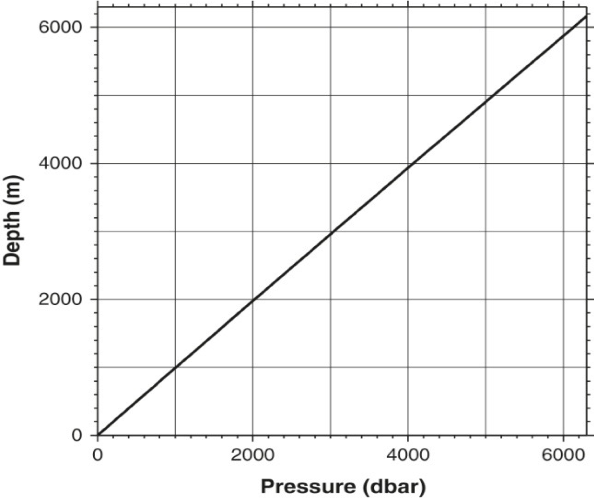
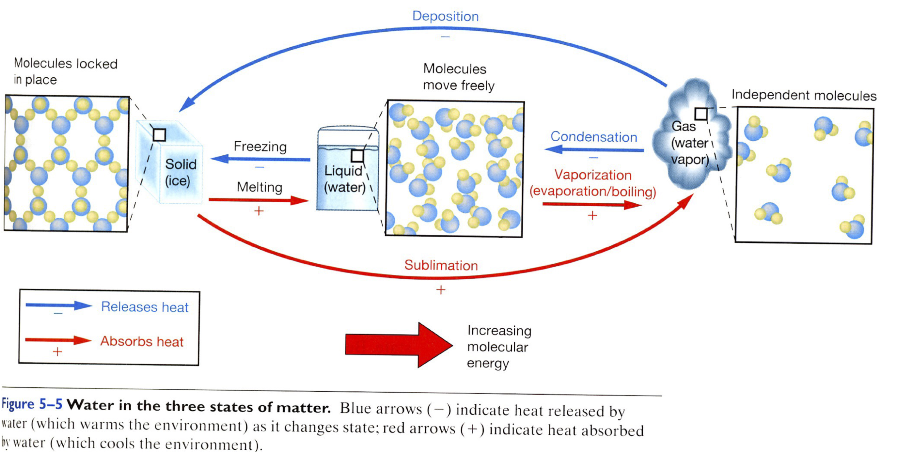
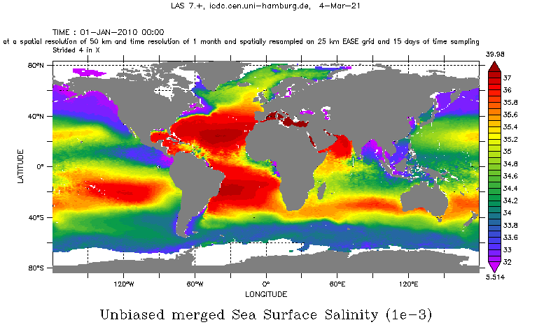
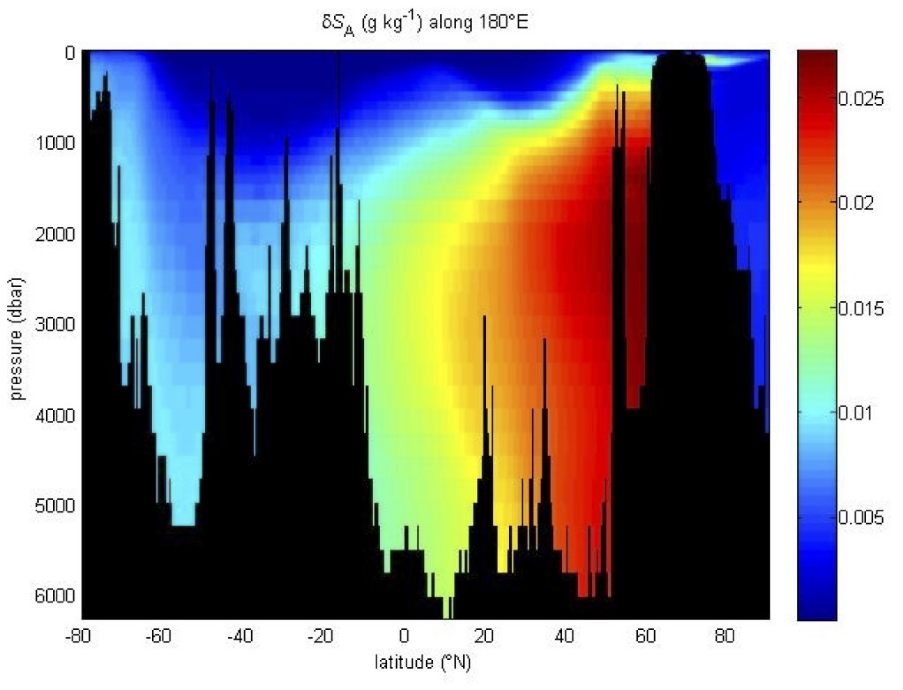

# Physical properties of seawater

$\newcommand{\pfrac}[2]{\frac{\partial #1}{\partial #2}}$

$\newcommand{\sW}{\mathrm{W}}$
$\newcommand{\sH}{\mathrm{H}}$
$\newcommand{\sU}{\mathrm{U}}$
$\newcommand{\sL}{\mathrm{L}}$
$\newcommand{\sT}{\mathrm{T}}$

## Pressure 

### Definitions, units

Pressure (mostly) results from the the weight of mass above it (from water and air).

In the ocean, pressure is a force-per-unit area.  However, the part of the pressure that drives fluid flow is the pressure difference between two places, or pressure gradient (we'll see this in a few weeks).  Normally, things like to flow from high to low pressure, but we'll see that under the effect of Earth's rotation, it's not quite that simple.  Units for pressure are tricky.  Standard units for pressure are Pascals or Pa, but oceanographers report pressure in decibars or dbar (sometimes also db, but I prefer dbar over db since db also refers to decibels).

Why do oceanographers use dbar?  It's a convenient notation because of the _approximate_ equivalence between metres deep and dbar.  Under the weight of 10 m of water, you would measure approximately (but a bit more than) 10 dbar of pressure.  Under the weight of 1000 m of water, you would measure approximately (but a bit more than) 1000 dbar of pressure.  

Ok, but everything else in the equations of motion is in SI units, which means that the pressure variables in the equations must be in Pa.  

What this means for you:

- Remember that all variables in your equations should be calculated in SI or mks units.  I.e., velocities should be in m/s (not cm/s), distances should be in m (not kilometers or cm), time should be in seconds (not years or days), and pressure needs to be in Pa.  

    $$\mbox{Pa}=\frac{\mbox{N}}{\mbox{m}^2}=\frac{\mbox{kg m}}{\mbox{s}^2}\frac{1}{\mbox{m}^2}$$

- However, as an oceanographer, you should report all pressures in dbar.  This means when working with the equations, use Pa, but upon reporting your answer, convert the pressure from units of Pa to dbar, where the equivalence is given as

    $$1 \mbox{bar} = 10^5 \mbox{ Pa} = 10\mbox{ dbar}$$

$\blacklozenge$ See end-of-lecture example for working with units.

### Hydrostatic pressure

We said above that pressure gradients drive fluid flow.  When there is not fluid flow (i.e., when the water is static), measured pressure is due to the weight of the fluid overhead.  

$$ p = \frac{\mbox{weight}}{\mbox{unit area}}\ .$$

Using Newton's second law, the weight of an object is mass times gravity.  
For the ocean, recall that we move from using mass to density $\rho_0$ (where the subscript indicates that it is a constant) and $\mbox{mass}=\rho_0(\mbox{volume})$. Then
\begin{align*}
\mbox{weight of fluid} &= (\mbox{mass})(\mbox{gravity})\\
&=\rho_0(\mbox{volume})(g)
\end{align*}

If we write our unit area as given by length scales $\delta x$ and $\delta y$, then our volume can be $\delta x$ by $\delta y$ by some height $h$.  Then our pressure would be

$$p=\frac{\rho_0(\delta x\, \delta y\, h)g}{\delta x\,\delta y} = \rho_0 gh$$

Now, this is  the pressure due to the water, but in the ocean with a *free surface* there is another fluid above, the atmosphere.  Thinking back to weight and Newton's second law, do you expect weight to be cumulative?  That is, if you were carrying 10 packages, and above them was 1 more, would you feel the weight of 10 or 11 packages?  Here, we have to consider the pressure of the atmosphere, so that we actually have

$$\boxed{p = p_{atm}+\rho_0 gh\ .}$$

This is hydrostatic pressure for a constant density fluid.  It is a simplification we will revisit more carefuly in the next section, where we will allow the density of water to vary (which it does in the real ocean).

$\blacklozenge$  See example at the end of notes for calculating hydrostatic pressure.

*DPO Fig 3.2: The relation between depth and pressure, using a station in the northwest Pacific at 41° 53’N, 146° 18’W.*

### Measurement of pressure

(see Messmethoden)

### Examples

#### Ex1. Working with units
We know that 
$\mbox{bar} = 10^5 \mbox{ Pa} = 10\mbox{ dbar}\ .$
If you are working in SI units, and you calculated  pressure in Pa, how do you convert to pressure in dbar (the common units for oceanographers)?

#### Ex2. Hydrostatic pressure
Suppose water density is about 1030 kg m$^{-2}$.  If gravity is $9.8$ m $\mbox{s}^{-2}$, then what would be the measured pressure at 1000 m deep?  At 3000 m deep?

## Water

### The water molecule

Pure water has a number of unique characteristics:
- The H$_2$O molecule is an electrical dipole, leading to *high solubility* of water,
- H$_2$O molecules can be densly packed ("clustering"): *density maximum* at 4$^\circ$C,
- there is a substantial *volume increase* at freezing (crystal grid).

There are two isotopes: the majority of water molecules are $^{16}$O (99.8% of all water on Earth) which evaporates more easily and precipitates less easily than $^{18}$O (0.2%).

### State of Matter

Water exists in three states: solid, liquid and gaseous.  The *phase diagram* for H$_2$O shows the occurrence of the three states as a function of temperature and pressure.

*Latent heat* is the energy released or absorbed by a molecule, during a constant-temperature/constant-pressure process.  The most relevant example is the *latent heat of fusion* for a phase change, *melting of ice, vaporizing water*.

*Temperature and pressure cause changes in the phase or state of water.  There is only one combination of temperature and pressure at which water can exist simultaneously as gas, liquid and solid.  This is the triple point.  The boiling point (BP) at 1 atm (760 mm) occurs at 100$^\circ$ and is one point on a curve defining the boundary between liquid and gas (steam). (Thurman & Trujillo, 2003).*

## Temperature

### Definitions, units 

Temperture is defined in statistical mechanics in terms of heat energy (T is temperature, Q is heat) where it is a measure of energy at the molecular level.

Heat content is zero at absolute zero temperature (Kelvin scale), where units for temperature are Kelvin and degrees Celcius (also called *degrees centigrade*):

$$T_K = T_C + 273.16$$
where $T_K$ is in Kelvin, $T_C$ is in Celcius.  Note: heat content is not 0 at 0$^\circ$C.  It is zero at 0 K where there is zero entropy (no motion of molecules).

Calibration of thermometers:
- triple point of 'equilibrium hydrogen' at 13.80033 K.
- triple point of water at 0.01$^\circ$C
- melting point of Gallium at 29.7646$^\circ$C
- freezing point of Indium at 156.5985$^\circ$C

There are various definitions of temperature defined between the calibration points above,
- IPTS-68: polynomial fit between reference points
- IPTS-90: correction $T_{68}  = 1.00024 T_{90}$  ($^\circ$C): the differences are $<0.001$ K within the oceanic temperature range ($-2.6 \mbox{ to } 30^\circ$C), where the lower limit is defined by the freezing point (below zero because of salt content - roughly -1.8$^\circ$C)

### Measurement of temperature

(from course on Messmethoden)

### Potential temperature

If a water volume is compressed adiabatically (without exchanging heat with its surroundings), its temperature rises.  Hence, it is useful to define a *potential temperature* at the temperature $\theta$, $\theta_1$, $\theta_2$, etc of a water body that has been brought adiabatically to the surface or another reference depth (1000 dbar, 2000 dbar, etc).  

Potential temperature is a *conserved quantity*, i.e. it can be tracked through the ocean and used for modelling.  

*Figure DPO 3.3: (a) Potential temperature (q) and temperature (T) (°C), (b) conductivity (mmho), and (c) salinity in the northeastern North Pacific (36° 30’N, 135°W).*

### Heat content

The heat content of a water volume is defined as

$$dQ = \rho c_p dT$$

where density $\rho$ and specific heat $c_p$ are functions of temperature (and pressure).  For a rough estimate, we use $\rho\approx 1025$ kg m$^{-3}$ and $c_p \approx 4000$ J/kg/K.  Specific heat is a function of temperature and pressure.  Related quantities are energy: 1 J = 1 kg m$^2$ s$^{-2}$, the temporal change of energy: 1 W = 1 J s$^{-1}$ and the heat flux: 1 W m$^{-2}$ = 1 kg s$^{-3}$.

## Salinity

### Definitions, units

Conceptually, salinity is defined as the mass of matter (expressed in grams) dissolved in a kilogram of seawater.  Units, according to this definition, are gm/kg in parts per thousand (o/oo) or "psu" (practical salinity units) using conductivity, temperature and PSS78.  

Seawater has a high solubility, with dissolved matter in the water classified as major, minor and trace elements.  Major constituents include chloride, sodium, sulfate, etc.  Minor constituients include carbon dioxide, bromine, carbon, nitrogen, oxygen, silicon.  Trace elements include phosphorus, iodide, iron, manganese, etc.

- Sea salt is primarily comprised of sodium chloride (NaCl).
- while salinities vary from region to region, the proportions or ratios between the major ions in the open ocean are remarkably constant: this is the principle of constant proportions ("Dittmar's law" or "law of equal proportions").  
- conservative constituents: those major ions that do not change in proportion
- non-conservative constituents: minor ions and dissolved substances that do change in their proportions due to biological or chemical processes.

*Figure: Chemical composition of seawater.*

Seawater contains approximately 3.5% salts, dissolved gases, organic substances and undissolved particulate matter.  The salinity range in antural water bodies: 0 g/kg to 40 g/kg.  The presence of these constituents influences most physical properties of seawater (density, compressibility, freezing point, temperature of the density maximum, light absorption) and determine conductivity and osmotic pressure.

In practice, it is difficult to measure the mass of dissolved salts in seawater.  However, based on the observation that the various components contribute to salinity in a fixed ratio (are conservative), it allows the determination of salt content through the measurement of only one constituent.   Determination of salinity could then be made through the measurement of chloride.  Chloride content was defined in 1902 as the total amount in grams of chlorine ions contained in one kilogram of seawater if all the halogens are replaced by chlorides.  The definition reflects the chemical filtration process for the determination of chloride content and is still of importance when dealing with historical data.

- Typical ocean salinity is 34 to 36 gm seasalt/kg seawater.
- Seawater contains a wide range of salvents of which chlorine is the most abundant
- The average ocean salinity is 34.9${^0}/_{00}$ 
with a relatively constant distribution of solvents

*Figure from ESA-CCI: Sea surface salinity, accessed https://www.cen.uni-hamburg.de/en/icdc/data/ocean/esa-cci-sea-surface-salinity.html on 3 April 2023.*

### Absolute salinity

Databases archive salinity values according to "practical salinity PSS-78", using so-called "standard seawater" taken from depths of the North Atlantic (40-50°N) as the "reference salinity", where

$$S_R\approx \mu_{ps}S\mbox{ [g/kg]}$$

with $\mu_{ps}=35.16504/35$ for $2<S<42$ g/kg.

The **absolute salinity** ($S_A$), however, takes into account the actual composition of water, where it is defined as: $S_A$ is the mass fraction of dissolved non-H$_2$O material in the seawater sample at its pressure and temperature. 

*Figure from McDougall et al. 2010: Difference between absolute salinity and reference salinity at 2000 dbar.*

*Figure from McDougal et al. 2010: Difference between absolute salinity and reference salinity in a section at 180°E.*