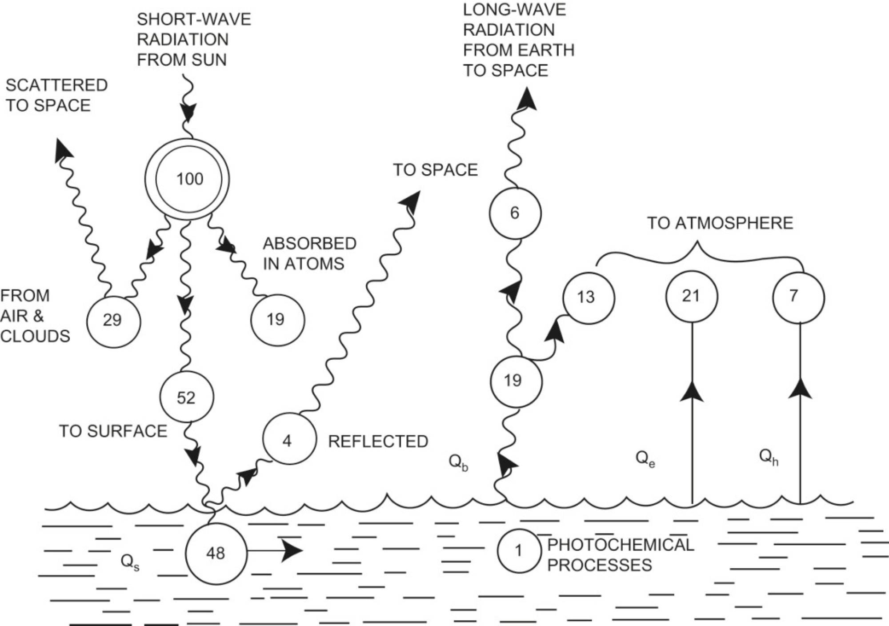

# Air-sea fluxes

The ocean is driven from the surface (fluxes at the lower boundary are at least two orders of magnitude smaller).  We have to consider fluxes of **heat**, **freshwater** and **momentum**.

## Aims for the topic

Gain a general appreciation for the forcing that occurs at the sea surface (heat, freshwater and wind)
- Heat fluxes: List the main components of air-sea heat fluxes and their signs. 
- Freshwater fluxes: Understand how atmosphere/land/ice processes can change ocean salinity
- Wind stress: Identify the trade winds and mid-latitude westerlies

Pay attention to:
- Sign convention – e.g., is positive warming or cooling the ocean?
- Where and when (which season) are fluxes large?

## Global hydrography

The term **hydrography** refers to the measurement and description of temperature and salinity distributions in the ocean.

A **climatology** is a multi-decade average of a quantity (e.g., temperature, salinity) that may be used as a reference to identify typical patterns of that variable.

The climatology of observed sea surface temperature (SST) shows a generally zonal distribution of isotherms, with some notable exceptions that are due to the proximity of land and the ocean circulation.

![[Pasted image 20230329174046.png]]Satellite infrared sea surface temperature (°C; nighttime only), averaged to 50 km and 1 week, for January 3, 2008. White is sea ice. (See Figure S4.1 from the online supplementary material for this image and an image from July 3, 2008, both in color). _Source: From NOAA NESDIS (2009)_. [DPO Fig 4.1b](http://booksite.academicpress.com/DPO/gallery/ch04/004001b.jpg)

*Figure DPO 5.5: Distribution of 100 units of incoming shortwave radiation from the sun to Earth’s atmosphere and surface: long-term world averages.*